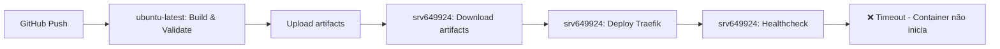

# 🔍 ANÁLISE COMPLETA DO WORKFLOW CI/CD

## ✅ **CONFIRMAÇÃO: Deploy está CORRETO no Servidor Remoto**

### 🎯 **Execução no Local Correto**
```
✅ Runner: srv649924 (Hostinger)
✅ Tipo: Self-hosted runner
✅ Localização: /home/runner/actions-runner/conexao-de-sorte-traefik-infraestrutura/
✅ Não executa no GitHub Actions
```

### 🔧 **Configuração Correta do CI/CD**
```yaml
# .github/workflows/ci-cd.yml (Linha 58)
deploy-selfhosted:
  runs-on: [ self-hosted, Linux, X64, conexao, conexao-de-sorte-traefik-infraestrutura ]
  # ☝️ CORRETO: Especifica self-hosted com labels únicos do servidor
```

## 📊 **Análise do Workflow Execution**

### Job 1: `validate-and-build` ✅
- **Local**: GitHub Actions (ubuntu-latest) - ✅ **CORRETO**
- **Função**: Validação e criação de artifacts
- **Status**: Sucesso

### Job 2: `deploy-selfhosted` ⚠️
- **Local**: Servidor Hostinger srv649924 - ✅ **CORRETO**
- **Função**: Deploy real no ambiente de produção
- **Status**: Deploy executado, mas container com problemas

## 🔄 **Fluxo de Execução Atual**



## 📋 **Detalhes do Deploy no Servidor Remoto**

### ✅ **Etapas Bem-sucedidas**
1. **Checkout do código**: ✅ Commit `10ee41a` (nossa correção)
2. **Download de artifacts**: ✅ 11397 bytes baixados
3. **Criação de Docker Secrets**: ✅ Todos os secrets criados
4. **Deploy do stack**: ✅ Stack `conexao-traefik` deployado
5. **Verificação inicial**: ✅ Serviço criado

### ❌ **Problema na Inicialização**
```
🚨 RÉPLICAS: 0/1 (Container não consegue inicializar)
🚨 TIMEOUT: 120 segundos aguardando réplicas 1/1
🚨 CAUSA: Erros YAML identificados anteriormente impedem inicialização
```

## 🎯 **Conclusão da Análise**

### ✅ **O que está CORRETO**
- Deploy executa no servidor remoto Hostinger ✅
- Self-hosted runner configurado corretamente ✅
- Scripts executam no ambiente correto ✅
- Docker Swarm e rede funcionando ✅
- Correção do backend-routes.yml aplicada ✅

### ⚠️ **O que precisa ser resolvido**
- Container Traefik não consegue inicializar devido a:
  1. Erros do container frontend (sintaxe Traefik v2)
  2. Possíveis outros erros de configuração
  3. Problemas DNS com subdomínios

## 🚀 **Próximas Ações Recomendadas**

1. **Aguardar próximo deploy** com backend-routes.yml corrigido
2. **Investigar logs detalhados** do container Traefik no servidor
3. **Considerar restart** do container frontend problemático
4. **Validar configurações DNS** para subdomínios

---
**Status**: ✅ **CI/CD configurado corretamente para servidor remoto**
**Problema**: ⚠️ **Container não inicializa devido a erros de configuração**
**Próximo Passo**: 🔍 **Debug específico do container Traefik**